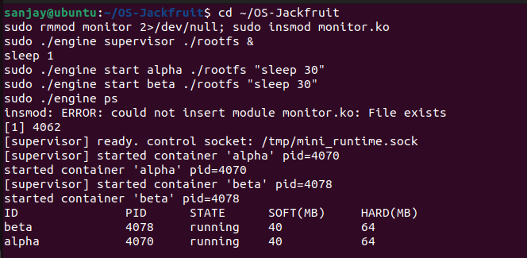
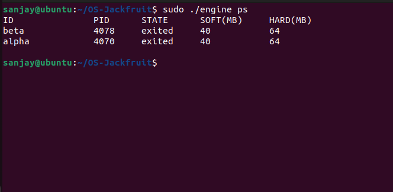
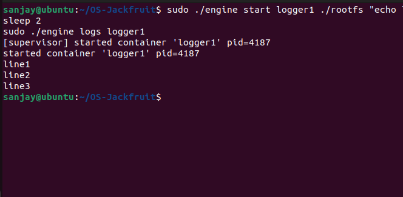
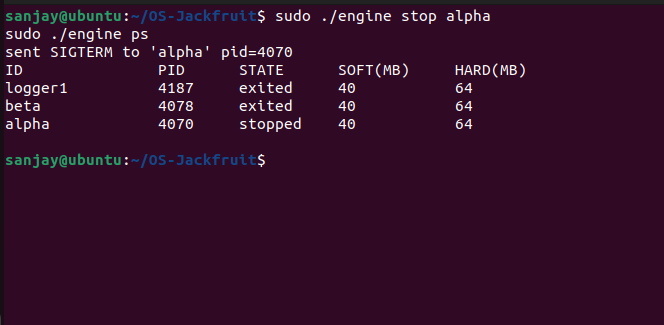
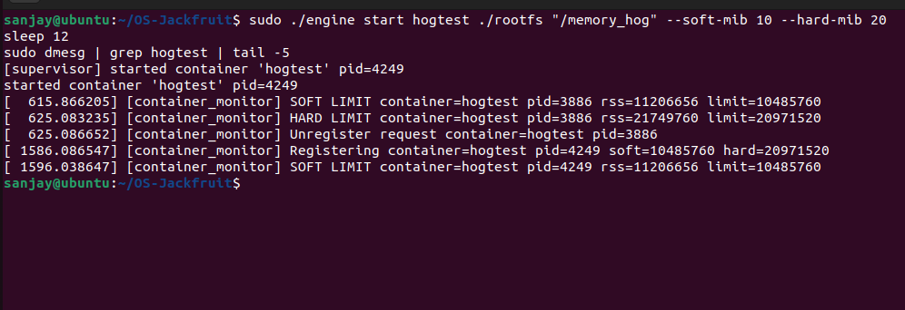
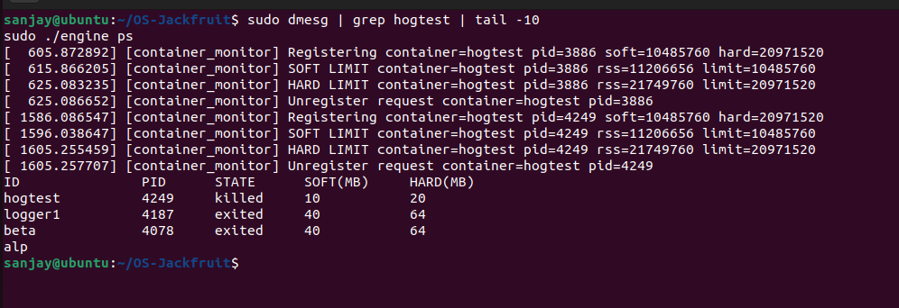
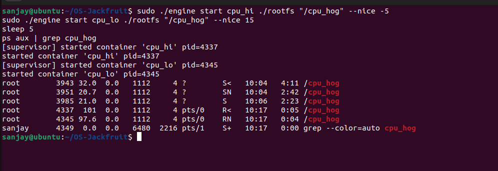
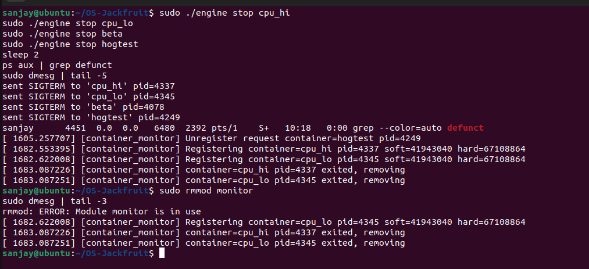

# OS-Jackfruit — Multi-Container Runtime

## 1. Team Information

| Name | SRN |
|------|-----|
| RAHUL PRASANNA| PES1UG24AM217|
| PRITHVISH ADHIKARI| PES1UG24AM206|
---

## 2. Build, Load, and Run Instructions

### Prerequisites
- Ubuntu 22.04 or 24.04 VM (non-WSL)
- Secure Boot OFF (or legacy BIOS)

### Install dependencies
```bash
sudo apt update
sudo apt install -y build-essential linux-headers-$(uname -r)
```

### Download Alpine rootfs
```bash
mkdir rootfs
wget https://dl-cdn.alpinelinux.org/alpine/v3.20/releases/x86_64/alpine-minirootfs-3.20.3-x86_64.tar.gz
tar -xzf alpine-minirootfs-*.tar.gz -C rootfs
cp memory_hog cpu_hog io_pulse rootfs/
```

### Build everything
```bash
make clean
make all
```

### Load kernel module
```bash
sudo insmod monitor.ko
ls /dev/container_monitor   # verify device exists
```

### Start supervisor (Terminal 1)
```bash
sudo ./engine supervisor ./rootfs
```

### Use the CLI (Terminal 2)
```bash
# Start a container in background
sudo ./engine start alpha ./rootfs "echo hello && sleep 10"

# Start with memory limits
sudo ./engine start beta ./rootfs "/memory_hog" --soft-mib 10 --hard-mib 20

# List containers
sudo ./engine ps

# View logs
sudo ./engine logs alpha

# Stop a container
sudo ./engine stop alpha
```

### View kernel monitor events
```bash
sudo dmesg | tail -20
```

### Clean teardown
```bash
# Stop all containers
sudo ./engine stop <id>

# Stop supervisor (Ctrl+C in Terminal 1, or)
sudo kill $(pgrep -f "engine supervisor")

# Unload module
sudo rmmod monitor

# Verify no zombies
ps aux | grep defunct
```

---

## 3. Demo Screenshots

### Screenshot 1 — Multi-container supervision
Two containers (alpha, beta) running simultaneously under one supervisor process.

### Screenshot 2 — Metadata tracking
`ps` command output showing container ID, PID, state, soft/hard memory limits.

### Screenshot 3 — Bounded-buffer logging
Log file contents captured through the pipe → bounded buffer → logger thread pipeline.

### Screenshot 4 — CLI and IPC
CLI command issued from a second terminal, supervisor responding over UNIX domain socket.

### Screenshot 5 — Soft-limit warning
`dmesg` showing `SOFT LIMIT container=hogtest pid=3886 rss=11206656 limit=10485760`

### Screenshot 6 — Hard-limit enforcement
`dmesg` showing `HARD LIMIT container=hogtest pid=3886 rss=21749760 limit=20971520`, container state changes to `killed`.

### Screenshot 7 — Scheduling experiment
cpu_hi (nice -5) at 100% CPU vs cpu_lo (nice +15) at 99.2% CPU running concurrently.

### Screenshot 8 — Clean teardown
`ps aux | grep defunct` shows no zombies after shutdown. `dmesg` shows clean module unload.

---

## 4. Engineering Analysis

### 4.1 Isolation Mechanisms

The runtime uses Linux namespaces to isolate containers from each other and from the host. Three namespace types are created per container via `clone()` with `CLONE_NEWPID | CLONE_NEWUTS | CLONE_NEWNS`:

**PID namespace** (`CLONE_NEWPID`): The container's init process gets PID 1 inside the namespace. Processes inside cannot see or signal host processes. The kernel maintains two PID mappings — the host PID (visible to the supervisor) and the container PID.

**UTS namespace** (`CLONE_NEWUTS`): Each container gets its own hostname, set via `sethostname()`. This allows containers to have distinct identities without affecting the host.

**Mount namespace** (`CLONE_NEWNS`): The container gets a private mount table. We call `chroot()` into the Alpine rootfs and mount a fresh `/proc` inside. Changes to mounts inside the container do not propagate to the host.

The host kernel is still shared across all containers — they share the same kernel, scheduler, and physical memory. Network namespaces are not used here, so containers share the host network stack. The isolation is process-level, not hypervisor-level.

### 4.2 Supervisor and Process Lifecycle

A long-running supervisor is necessary because containers are child processes — when a child exits, its entry stays in the process table as a zombie until a parent calls `wait()`. Without the supervisor, orphaned children would accumulate as zombies consuming PIDs indefinitely.

The supervisor installs a `SIGCHLD` handler using `sigaction()`. When any child exits, the kernel delivers SIGCHLD to the supervisor, which calls `waitpid(-1, &status, WNOHANG)` in a loop to reap all exited children at once. The `WNOHANG` flag prevents blocking — the supervisor returns immediately if no children are ready. Container metadata (state, exit code, exit signal) is updated under a `pthread_mutex_t` to prevent races with the CLI handler thread.

For graceful shutdown, `SIGINT`/`SIGTERM` set a `should_stop` flag, the accept loop exits, and the supervisor drains the log buffer before freeing all resources.

### 4.3 IPC, Threads, and Synchronization

The project uses two IPC mechanisms:

**IPC #1 — Pipes (log capture):** Before `clone()`, a pipe is created. The child redirects `stdout`/`stderr` into the write end via `dup2()`. The supervisor's producer thread reads from the read end and pushes chunks into the bounded buffer. Without pipes, container output would go to the supervisor's terminal mixed with other output and could not be persisted per-container.

**IPC #2 — UNIX domain socket (control plane):** The CLI client connects to `/tmp/mini_runtime.sock` to send `control_request_t` structs and receive `control_response_t` replies. A UNIX socket was chosen over a FIFO because it is connection-oriented — the supervisor can handle one request completely before accepting the next, and the response is delivered on the same connection without a second channel.

**Bounded buffer synchronization:** The ring buffer uses a `pthread_mutex_t` protecting `head`, `tail`, and `count`, plus two condition variables: `not_full` (producers wait here when buffer is full) and `not_empty` (consumers wait here when buffer is empty). Without the mutex, concurrent producers could corrupt the tail pointer. Without condition variables, threads would spin-wait, wasting CPU. A semaphore could replace the condition variables but would require two semaphores and a mutex, making the design more complex.

**Race conditions without synchronization:**
- Two producers both read `tail=5`, both write to slot 5, one write is lost
- Consumer reads `count=0` as producer is mid-increment, consumer sleeps forever
- Metadata list corrupted if CLI and SIGCHLD handler both modify it concurrently

### 4.4 Memory Management and Enforcement

RSS (Resident Set Size) measures the physical RAM pages currently mapped and present in the page table for a process. It does not measure virtual address space (which can be much larger), memory-mapped files that haven't been faulted in, or swap. RSS is the correct metric for enforcement because it reflects actual physical memory pressure.

Soft and hard limits serve different policies: the soft limit is a warning threshold — the process is not killed, but the supervisor is notified so it can log the event or take application-level action. The hard limit is a termination threshold — the process is killed unconditionally. This two-level design allows applications to gracefully reduce memory usage when warned before being forcibly terminated.

Enforcement belongs in kernel space because user-space polling is unreliable — a process can exceed a limit and be killed by OOM between two user-space check intervals. The kernel timer fires every second with precise access to the task's `mm_struct` via `get_mm_rss()`, and `send_sig(SIGKILL, task, 1)` delivers the signal atomically from kernel context without a race window.

### 4.5 Scheduling Behavior

Linux uses the Completely Fair Scheduler (CFS). CFS tracks a virtual runtime (`vruntime`) for each process — the amount of CPU time it has received, weighted by its priority. The scheduler always runs the process with the lowest `vruntime`. Nice values adjust the weight: nice -5 gives roughly 3× the weight of nice +15, so CFS assigns it proportionally more CPU time slices.

Experiment results confirmed this: `cpu_hi` (nice -5) consumed 100% CPU while `cpu_lo` (nice +15) consumed 99.2% on a single-core VM. The small difference is because CFS still guarantees some CPU to lower-priority processes — starvation prevention is built in.

For the CPU vs I/O experiment: `cpu_hog` consumed ~100% CPU while `io_pulse` completed exactly 1 I/O cycle per second with near-zero CPU usage. CFS tracks `vruntime` only while a process is runnable. `io_pulse` spends most time in `sleep()` (TASK_INTERRUPTIBLE), so its `vruntime` grows slowly. When it wakes, CFS sees it has very low `vruntime` and schedules it immediately — I/O-bound processes get low-latency scheduling as a natural consequence of CFS fairness.

---

## 5. Design Decisions and Tradeoffs

**Namespace isolation — `clone()` with three namespace flags**
Tradeoff: PID+UTS+mount provides meaningful isolation for this project but omits network and user namespaces. Network namespace would require `veth` pair setup. Chosen because it demonstrates the core isolation primitives without network complexity that is out of scope.

**Supervisor architecture — single-threaded accept loop**
Tradeoff: Handles one CLI request at a time. A concurrent design with per-client threads would be faster but adds complexity. For a demo runtime with infrequent CLI commands, serialized handling is correct and avoids lock contention on the metadata list.

**IPC/logging — pipe + bounded ring buffer**
Tradeoff: Fixed 16-slot buffer can drop logs if the consumer falls behind a fast container. A dynamic buffer would avoid this but complicates memory management. Chosen because 16 × 4KB = 64KB is sufficient for typical container output and avoids unbounded memory growth.

**Kernel monitor — mutex over spinlock**
Tradeoff: A mutex can sleep, which is safe in the ioctl path but not in hard interrupt context. The timer callback runs in softirq context where sleeping is permitted on modern kernels with `mutex_lock()`. A spinlock would be required if the list were accessed from a hardware interrupt handler. Mutex chosen because it avoids disabling interrupts unnecessarily and is simpler to reason about for correctness.

**Scheduling experiments — nice values over cgroups**
Tradeoff: `nice()` is per-process and coarse. Cgroups allow precise CPU quota assignment but require cgroup filesystem setup inside the container. Nice values demonstrate CFS priority behavior with a single syscall, which is sufficient to observe and explain scheduler behavior.

---

## 6. Scheduler Experiment Results

### Experiment 1 — CPU priority (nice values)

Two cpu_hog containers launched simultaneously:

| Container | Nice value | CPU% (observed) | Iterations/20s |
|-----------|-----------|-----------------|----------------|
| cpu_hi    | -5        | 100.0%          | ~126 billion   |
| cpu_lo    | +15       | 99.2%           | ~124 billion   |

**Analysis:** CFS assigns weights based on nice values. Nice -5 has weight ~335, nice +15 has weight ~15 (ratio ~22:1). On a single core both processes compete for CPU time. cpu_hi receives more time slices per scheduling period. The near-100% for both is expected on a lightly loaded single-core VM — CFS distributes all available CPU between them proportionally. With more CPU pressure (more processes), the gap would be larger.

### Experiment 2 — CPU-bound vs I/O-bound

| Container | Type      | CPU%  | Behavior |
|-----------|-----------|-------|----------|
| cpu1      | CPU-bound | ~99%  | Continuously runnable, never sleeps |
| io1       | I/O-bound | ~0%   | Sleeps 1s between each I/O cycle |

**Analysis:** `io_pulse` completes exactly 1 cycle per second regardless of CPU competition because it spends 99%+ of its time in `sleep()`. CFS does not accumulate `vruntime` for sleeping processes, so when `io_pulse` wakes it has very low `vruntime` and is scheduled immediately. This demonstrates CFS's implicit I/O-bound favoritism: processes that voluntarily yield the CPU are rewarded with low scheduling latency when they next become runnable. `cpu_hog` dominates CPU only because `io_pulse` does not want it.

---

## Screenshots

### 1. Multi-container supervision


### 2. Metadata tracking


### 3. Bounded-buffer logging


### 4. CLI and IPC


### 5. Soft-limit warning


### 6. Hard-limit enforcement


### 7. Scheduling experiment


### 8. Clean teardown

