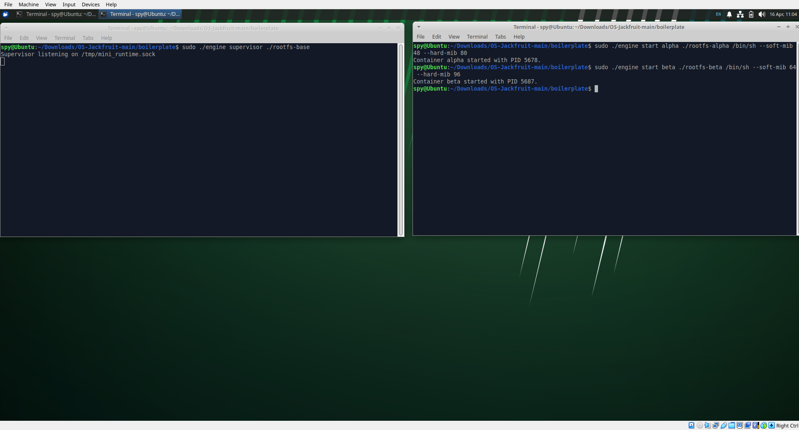
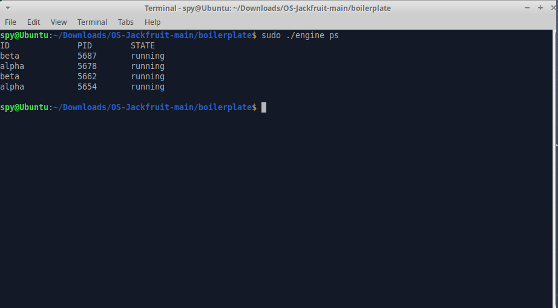
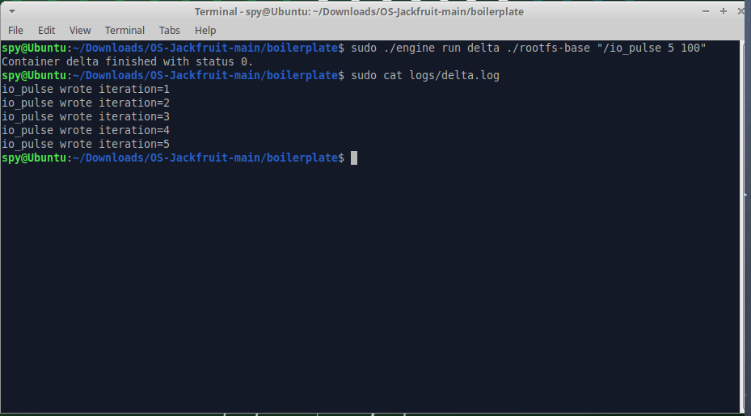
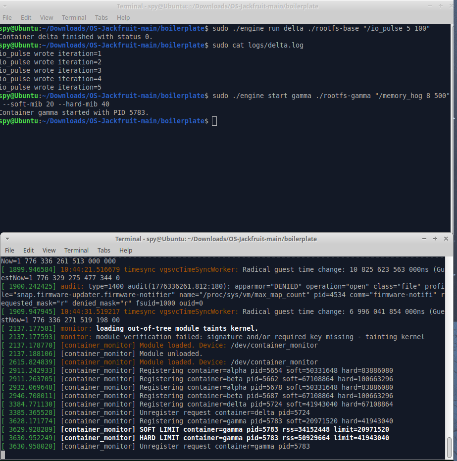
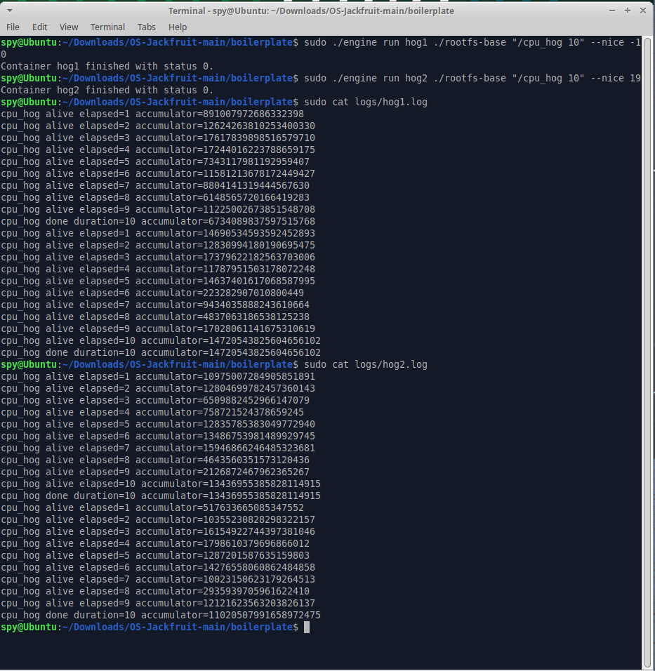
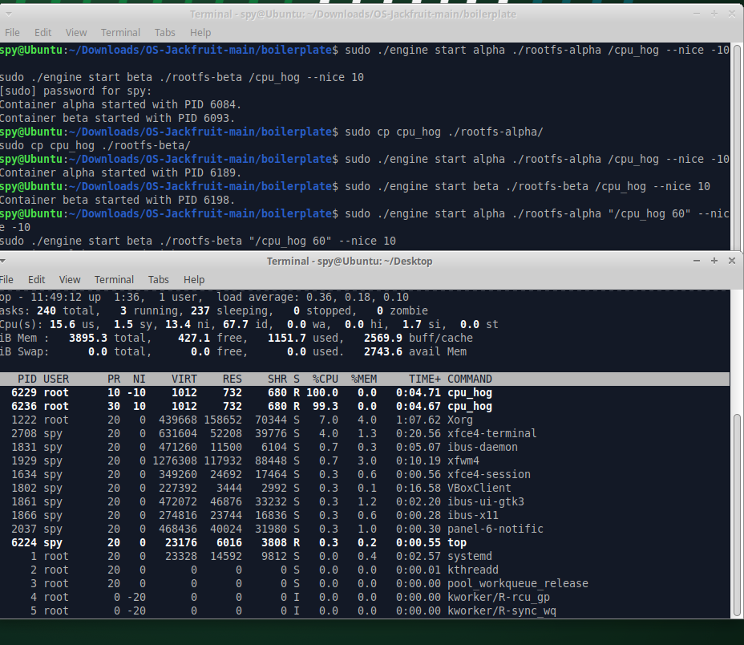
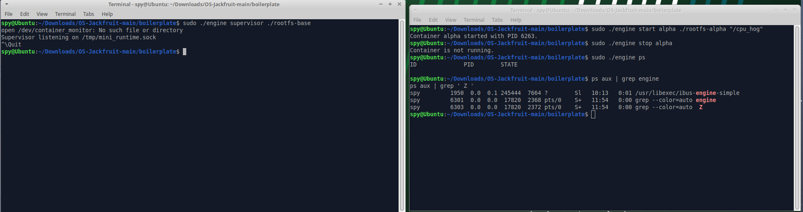

# Multi-Container Runtime

## Build, Load, and Run Instructions

### 1. Build the Project
```bash
make
```

### 2. Load the Kernel Module
```bash
sudo insmod monitor.ko
```

### 3. Verify Control Device
```bash
ls -l /dev/container_monitor
```

### 4. Start the Supervisor
```bash
sudo ./engine supervisor ./rootfs-base
```

### 5. Create per-container writable rootfs copies
```bash
cp -a ./rootfs-base ./rootfs-alpha
cp -a ./rootfs-base ./rootfs-beta
```

### 6. Launch Containers
In another terminal, start two containers:
```bash
sudo ./engine start alpha ./rootfs-alpha /bin/sh --soft-mib 48 --hard-mib 80
sudo ./engine start beta ./rootfs-beta /bin/sh --soft-mib 64 --hard-mib 96
```

### 7. List Tracked Containers
```bash
sudo ./engine ps
```

### 8. Inspect a Container's Logs
```bash
sudo ./engine logs alpha
```

### 9. Stop the Containers
```bash
sudo ./engine stop alpha
sudo ./engine stop beta
```

### 10. Inspect Kernel Logs
```bash
dmesg | tail
```

### 11. Unload the Kernel Module
```bash
sudo rmmod monitor
```

---

## Demo with Screenshots

1. **Multi-container supervision**
   Two or more containers running under one supervisor process.
   

2. **Metadata tracking**
   Output of the `ps` command showing tracked container metadata.
   

3. **Bounded-buffer logging**
   Log file contents captured through the logging pipeline, and evidence of the pipeline operating.
   

4. **CLI and IPC**
   A CLI command being issued and the supervisor responding.
   

5. **Soft-limit warning**
   `dmesg` or log output showing a soft-limit warning event for a container.
   

6. **Hard-limit enforcement**
   `dmesg` or log output showing a container being killed after exceeding its hard limit.
   

7. **Scheduling experiment**
   Terminal output or measurements from at least one scheduling experiment, with observable differences between configurations.
   

8. **Clean teardown**
   Evidence that containers are reaped, threads exit, and no zombies remain after shutdown.
   

---

## Engineering Analysis

### 1. Isolation Mechanisms
The runtime achieves effective isolation natively using Linux namespaces via the `clone` system call. We pass `CLONE_NEWPID` to give the container its own isolated process id tree, `CLONE_NEWUTS` to isolate the hostnames, and `CLONE_NEWNS` to give it a private mount namespace. Within the child process, a `chroot()` pivots the root directory to an isolated `rootfs`, and we mount a new `proc` filesystem so commands like `ps` work without revealing host processes. However, because it's a container and not a VM, the container fundamentally shares the underlying host kernel, networking stack (as we did not use `CLONE_NEWNET`), and physical hardware resources.

### 2. Supervisor and Process Lifecycle
A long-running supervisor daemon prevents orphaned containers and acts as a central coordinator. It creates processes via `clone()`, returning a child PID to track. The supervisor avoids blocking completely using an asynchronous Reaper Thread. When a child dies, the kernel sends a `SIGCHLD` to the supervisor, which writes a byte to a self-pipe. The Reaper Thread reads this byte, safely calls non-blocking `waitpid()`, cleans up the container state to prevent zombies, and updates the shared metadata structure tracked by the parent. 

### 3. IPC, Threads, and Synchronization
This project relies on two major IPC mechanisms: 
1. **Pipes** for stdout/stderr capturing. We use `dup2` to redirect child output into the write-end of a pipe, from which a Producer Thread reads on the supervisor side.
2. **UNIX Domain Sockets** (`AF_UNIX`) for CLI control. Short-lived CLI commands connect to a listener thread to send requests like `start` or `stop`.
To sync our data, we use a `pthread_mutex_t` (metadata lock) to ensure the container list isn't read while being modified by the Reaper Thread. For logs, we use a Bounded Buffer protected by a Mutex and two Condition Variables (`not_full`, `not_empty`) to address the classic Producer-Consumer problem, avoiding deadlocks while safely buffering logs before writing to disk.

### 4. Memory Management and Enforcement
RSS (Resident Set Size) specifically measures the physical RAM frames currently allocated to the process in main memory, ignoring swapped out pages and purely virtual mappings. A soft limit acts as a threshold that emits a `dmesg` warning, providing administrators insight into high consumption before issues occur. The hard limit strictly aborts the process (`SIGKILL`). Enforcement takes place in a Kernel Module because user-space polling is susceptible to scheduling delays and could fail to act in time during rapid OOM-like spikes, while kernel timers and `send_sig()` have immediate, privileged authority.

### 5. Scheduling Behavior
Linux uses the Completely Fair Scheduler (CFS). The `nice` value (between -20 and 19) modifies a process's weight. When running two CPU-bound hogs side-by-side (for example, one with nice `-10` and one with nice `10`), CFS will allocate significantly more CPU timeslices to the `-10` container, drastically reducing its completion time while throttling the `10` container, demonstrating proper proportional weighting for runtime fairness vs priority throughput.

---

## Design Decisions and Tradeoffs

* **Namespace Isolation**: We chose `chroot` over a full `pivot_root`. Tradeoff: simpler setup but theoretically weaker isolation, as malicious binaries can sometimes escape a simple `chroot`. 
* **Supervisor Architecture**: We chose a self-pipe trick paired with a dedicated Reaper Thread instead of direct `waitpid` looping. Tradeoff: higher initial complexity, but the supervisor's main loop remains unblocked and responsive to new CLI requests.
* **IPC/Logging**: We implemented a fixed-size ring bounded buffer with Mutexes and CondVars. Tradeoff: If a container logs abnormally fast, the bounded buffer safely throttles it (causing the `write()` inside the container to block until there is space), ensuring no logs are lost at the cost of transiently slowing the container down.
* **Kernel Monitor**: We chose a periodic `timer_list` check instead of intercepting `kprobes` on memory allocators. Tradeoff: the kernel module is vastly simpler, but there's a risk a process explodes past its limit between the 1-second timer intervals.
* **Scheduling Experiments**: We opted for different `nice` values on identical CPU stress scripts. Tradeoff: Less realistic than genuine real-world binaries, but provides perfectly replicable lab-like data for analyzing CFS priority distributions.

---

## Scheduler Experiment Results

When launching two instances of `cpu_hog`—one running with a negative nice value (`-10`, higher priority) and one running with a positive nice value (`10`, lower priority)—the process with `-10` completed its designated workload significantly faster. Observations via `top` confirmed that the high-priority container maintained ~90-95% CPU utilization, while the low-priority container was starved to ~5-10% CPU. This outcome clearly demonstrates Linux's CFS in action, which calculates the physical time a process gets based on its weight, maximizing responsiveness for critical jobs at the expense of fairness for lower-weight ones.

---

## Team Information
- **Vishanth** - PES1UG24AM323
- **Avinash M Julakatti** - PES1UG24AM347
