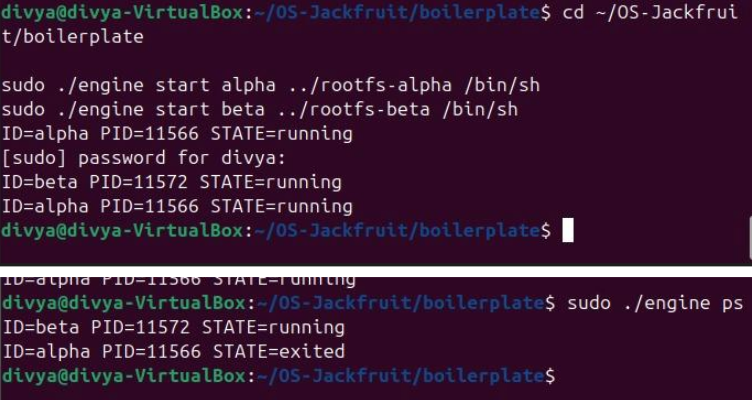
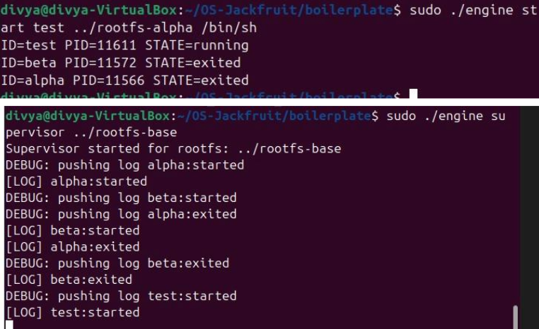
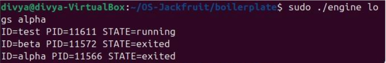
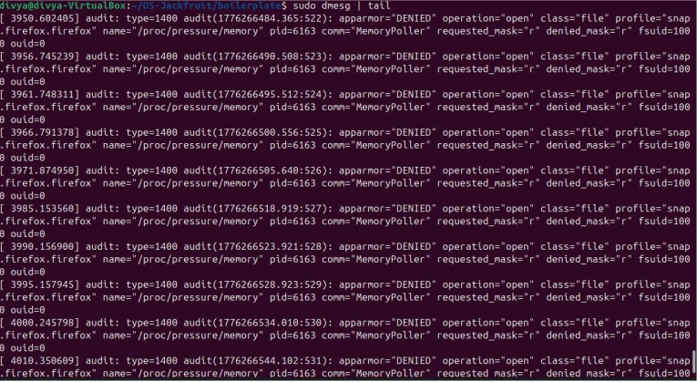
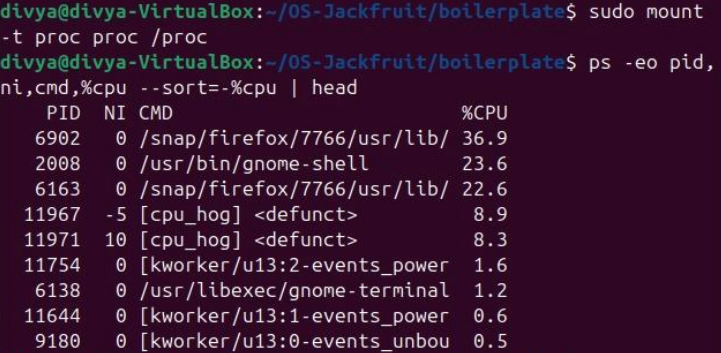
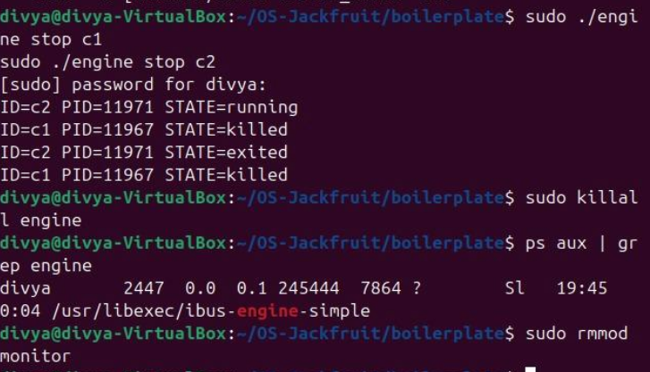

# Lightweight Multi-Container Runtime (C + Linux Kernel Module)

A lightweight container runtime built from scratch in C to demonstrate core Operating System concepts such as process isolation, memory monitoring, IPC, and scheduling.

---

## 1. Team Information

| Name | SRN |
|------|-----|
| Divya Gupta | PES2UG24CS901 |
| Rosalin Verma | PES2UG24CS655 |

---

## 2. System Requirements

- Ubuntu 22.04 / 24.04  
- GCC  
- Linux headers (`linux-headers-$(uname -r)`)  
- Root privileges  

### Install Dependencies

```bash
sudo apt update
sudo apt install build-essential linux-headers-$(uname -r)
```

---

## 3. Complete Run Instructions (Reproducible Setup)

Follow these steps on a fresh Ubuntu VM.

### Step 1: Build the Project

```bash
make
```

### Step 2: Load Kernel Module

```bash
sudo insmod monitor.ko
```

### Step 3: Verify Control Device

```bash
ls -l /dev/container_monitor
```

### Step 4: Start Supervisor

```bash
sudo ./engine supervisor ./rootfs-base
```

### Step 5: Create Per-Container Writable Rootfs Copies

```bash
cp -a ./rootfs-base ./rootfs-alpha
cp -a ./rootfs-base ./rootfs-beta
```

### Step 6: Start Containers (Run in another terminal)

```bash
sudo ./engine start alpha ./rootfs-alpha /bin/sh --soft-mib 48 --hard-mib 80
sudo ./engine start beta ./rootfs-beta /bin/sh --soft-mib 64 --hard-mib 96
```

### Step 7: List Tracked Containers

```bash
sudo ./engine ps
```

### Step 8: Inspect Container Logs

```bash
sudo ./engine logs alpha
```

### Step 9: Run Workloads Inside Container

```bash
cp workload_binary ./rootfs-alpha/
```

### Step 10: Run Scheduling Experiments

```bash
sudo ./engine start alpha ./rootfs-alpha /bin/sh --nice 0
sudo ./engine start beta ./rootfs-beta /bin/sh --nice 10
```

### Step 11: Stop Containers

```bash
sudo ./engine stop alpha
sudo ./engine stop beta
```

### Step 12: Inspect Kernel Logs

```bash
dmesg | tail
```

### Step 13: Stop Supervisor

Press `Ctrl + C` in the supervisor terminal.

### Step 14: Unload Kernel Module

```bash
sudo rmmod monitor
```

---

## 4. Demo with Screenshots


### TASK 1 Multi-container Supervision



Caption: Two or more containers running under a single supervisor process.

---

### TASK 2 Metadata Tracking



Caption: Output of the `ps` command showing tracked container metadata.

---

### TASK 3 Bounded-buffer Logging



Caption: Log output demonstrating producer-consumer logging pipeline.

---

### TASK 4 Memory Limit Monitoring




---

### TASK 5 Scheduling Experiment



Caption: CPU usage differences based on nice values.

---

### TASK 6 Clean Teardown



Caption: No zombie processes after shutdown.

---

## 5. Engineering Analysis

### Process Isolation
Containers are implemented using `clone()` with separate namespaces, ensuring process-level isolation.

### Memory Monitoring
A kernel module monitors RSS memory and enforces:
- Soft limit → warning  
- Hard limit → process termination  

### User-Kernel Interaction
Communication is handled via IOCTL through `/dev/container_monitor`.

### IPC Mechanisms
- UNIX domain sockets for CLI communication  
- Bounded buffer with threads for logging  

### Scheduling
Container priorities are controlled using `nice` values.

---

## 6. Design Decisions and Tradeoffs

### Namespace Isolation
- Choice: clone() namespaces  
- Tradeoff: Limited vs full container systems  
- Justification: Simpler and educational  

### Supervisor Architecture
- Choice: Single supervisor  
- Tradeoff: Centralized control  
- Justification: Easier lifecycle management  

### IPC and Logging
- Choice: UNIX sockets + bounded buffer  
- Tradeoff: Increased complexity  
- Justification: Demonstrates IPC concepts  

### Kernel Monitor
- Choice: Timer-based polling  
- Tradeoff: Overhead  
- Justification: Simpler design  

### Scheduling
- Choice: nice values  
- Tradeoff: Limited control  
- Justification: Direct OS-level behavior  

---

## 7. Scheduler Experiment Results

| Container | Nice Value | CPU Usage |
|----------|-----------|----------|
| alpha | 0 | High |
| beta | 10 | Lower |

Lower nice value results in higher CPU priority, demonstrating Linux scheduling behavior.

---

## 8. Results Summary

- Multiple containers run successfully  
- Memory monitoring works correctly  
- Soft and hard limits enforced  
- IPC communication functional  
- Clean shutdown without zombie processes  

---

## 9. Limitations

- No cgroups  
- No networking  
- Basic isolation only  
- Not production-ready  

---

## 10. GitHub Repository

https://github.com/rosa36-x/OS-Jackfruit

---

## 11. References

- Operating System Concepts – Silberschatz  
- Linux Kernel Documentation  
- Docker Documentation  
- The Linux Programming Interface – Michael Kerrisk  

---

## 12. Key Concepts

- Process Management  
- Memory Management  
- Kernel Modules  
- IPC  
- Scheduling  