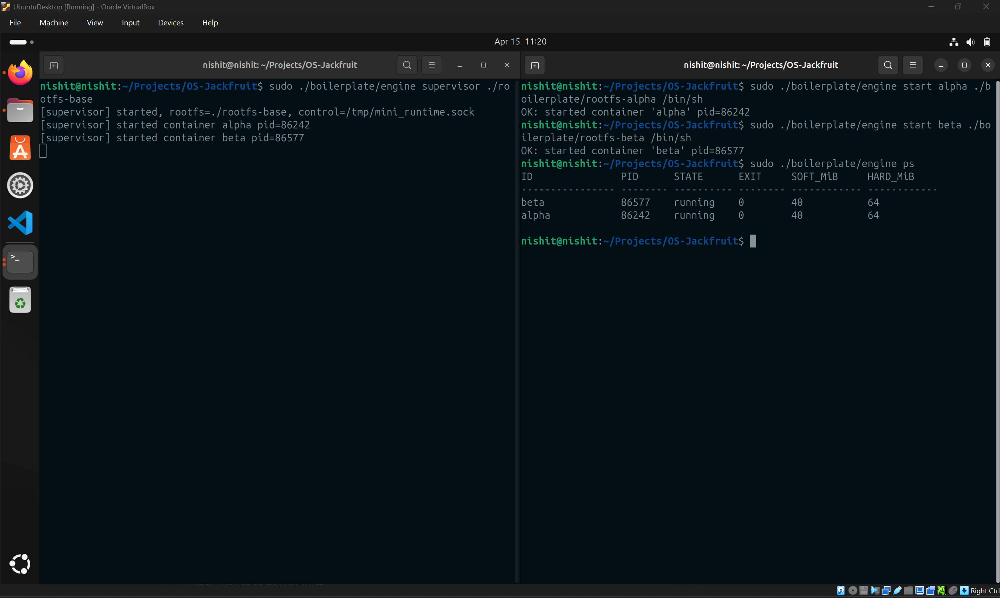
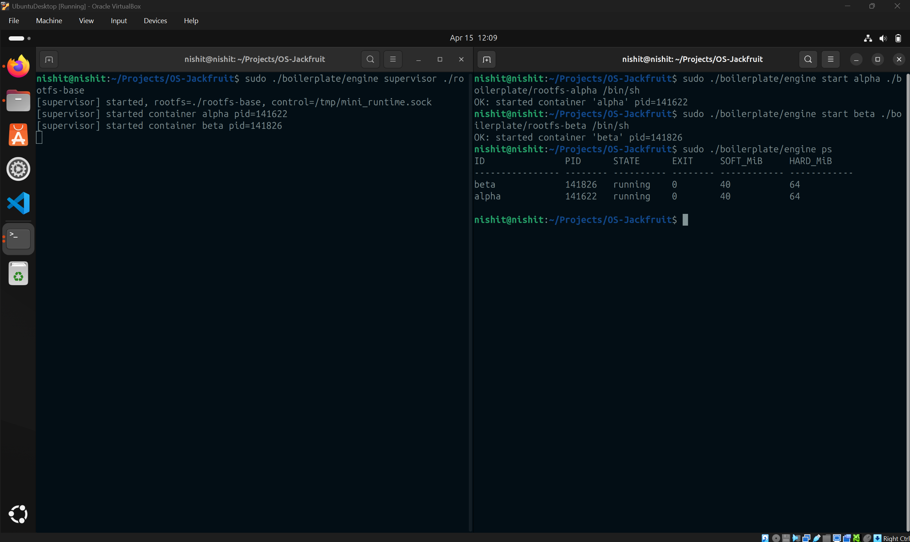
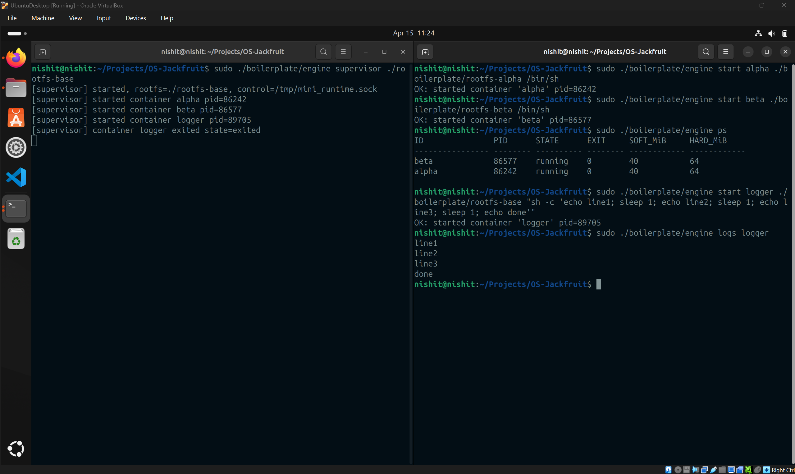
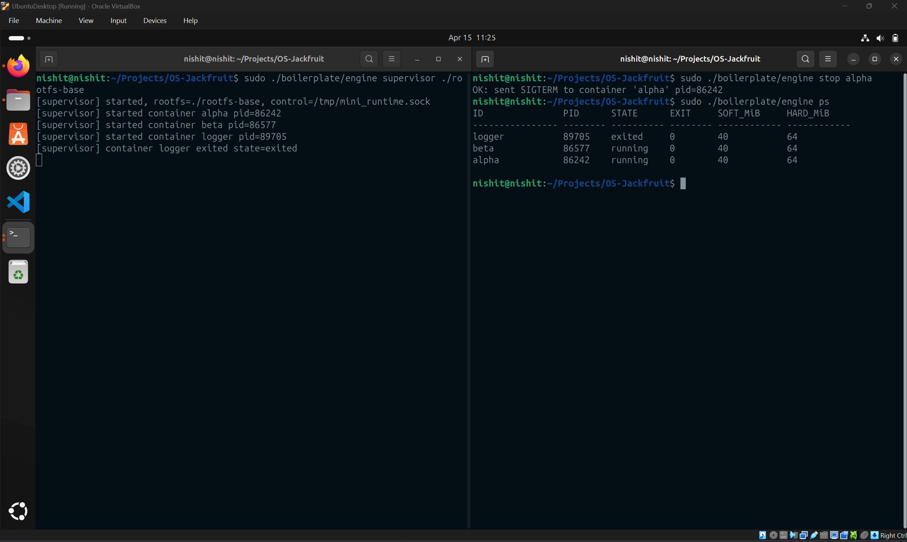
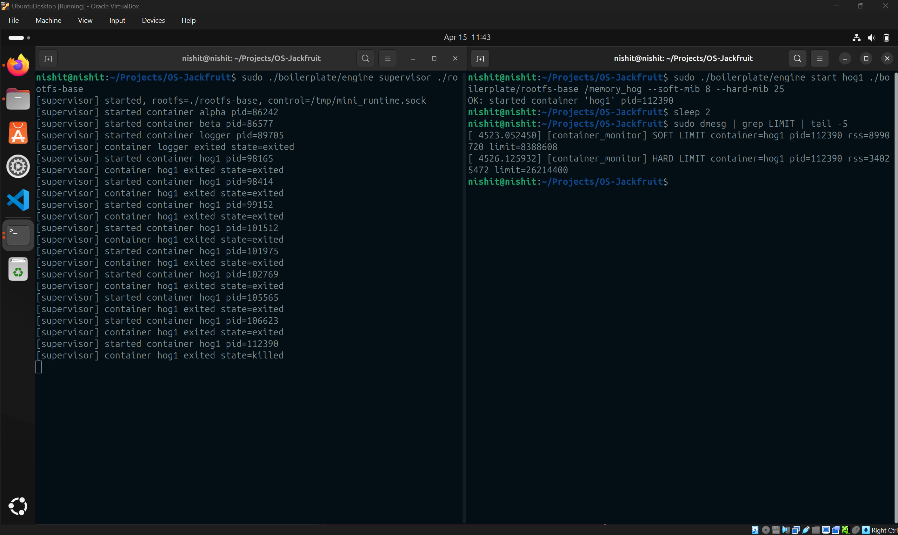
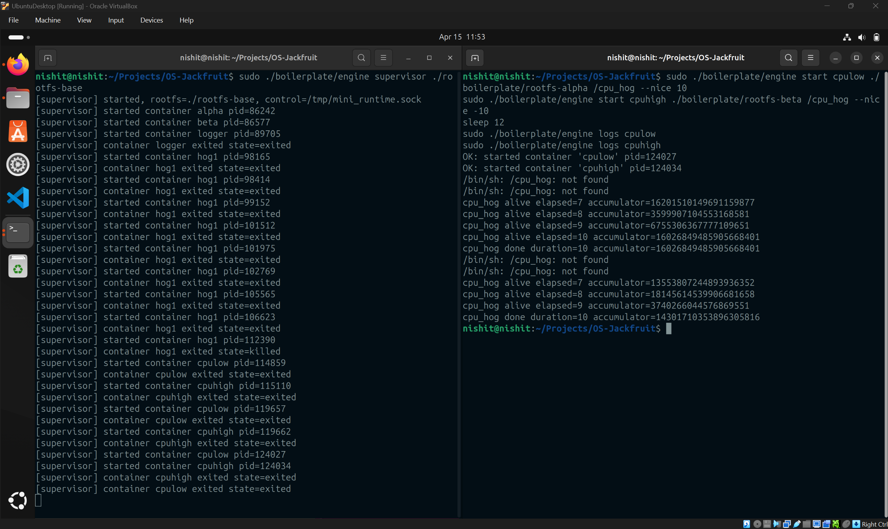
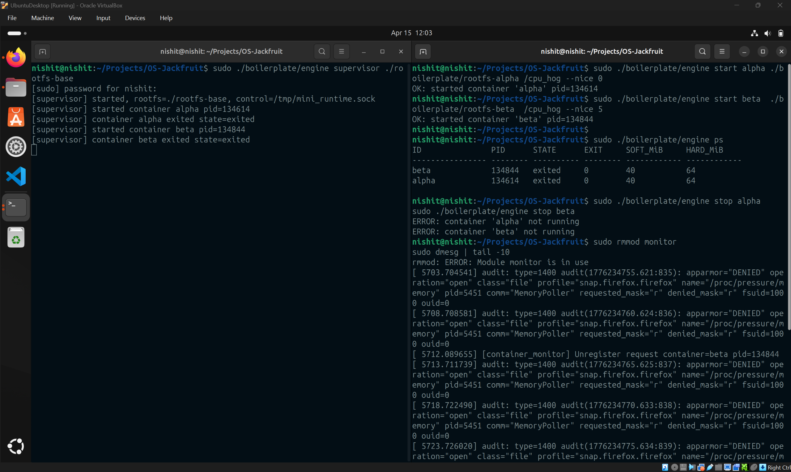
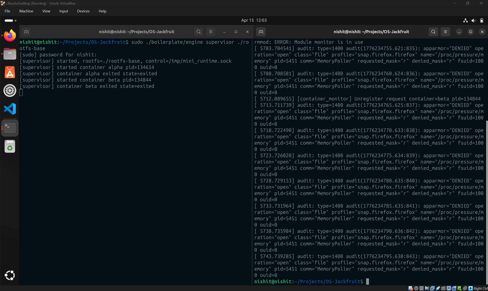

# Multi-Container Runtime

## 1. Team Information

| Name | SRN |
|------|-----|
| Nishit D B | PES1UG24CS303 |
| M Stuthi | PES1UG24CS283 |

---

## 2. Build, Load, and Run Instructions

### Prerequisites

- Ubuntu 22.04 / 24.04 VM — **Secure Boot must be OFF**
- Install dependencies:

```bash
sudo apt update
sudo apt install -y build-essential linux-headers-$(uname -r)
```

### Step 1 — Build

```bash
cd boilerplate
make
```

### Step 2 — Prepare Root Filesystems

```bash
cd ~/OS-Jackfruit
mkdir rootfs-base
wget https://dl-cdn.alpinelinux.org/alpine/v3.20/releases/x86_64/alpine-minirootfs-3.20.3-x86_64.tar.gz
tar -xzf alpine-minirootfs-3.20.3-x86_64.tar.gz -C rootfs-base

# Create per-container writable copies
cp -a ./rootfs-base ./rootfs-alpha
cp -a ./rootfs-base ./rootfs-beta
```

### Step 3 — Load Kernel Module

```bash
sudo insmod boilerplate/monitor.ko
ls -l /dev/container_monitor   # verify control device exists
```

### Step 4 — Start Supervisor

```bash
sudo ./boilerplate/engine supervisor ./rootfs-base
```

### Step 5 — Launch Containers *(in a second terminal)*

```bash
# Start two containers
sudo ./boilerplate/engine start alpha ./rootfs-alpha /bin/sh
sudo ./boilerplate/engine start beta  ./rootfs-beta  /bin/sh

# Inspect running containers
sudo ./boilerplate/engine ps

# View logs from a container
sudo ./boilerplate/engine logs alpha

# Stop a container
sudo ./boilerplate/engine stop alpha
```

### Step 6 — Memory Limit Test

```bash
cp boilerplate/memory_hog rootfs-base/
sudo ./boilerplate/engine start hog1 ./rootfs-base /memory_hog --soft-mib 8 --hard-mib 25
sleep 5
sudo dmesg | grep "SOFT LIMIT" | tail -1
sudo dmesg | grep "HARD LIMIT" | tail -1
sudo ./boilerplate/engine ps
```

### Step 7 — Scheduler Experiment

```bash
cp boilerplate/cpu_hog rootfs-base/
cp -a ./rootfs-base ./rootfs-alpha
cp -a ./rootfs-base ./rootfs-beta

sudo ./boilerplate/engine start cpulow  ./rootfs-alpha "/cpu_hog" --nice 10
sudo ./boilerplate/engine start cpuhigh ./rootfs-beta  "/cpu_hog" --nice -10
sleep 10
sudo ./boilerplate/engine logs cpulow
sudo ./boilerplate/engine logs cpuhigh
```

### Step 8 — Cleanup

```bash
sudo ./boilerplate/engine stop alpha
sudo ./boilerplate/engine stop beta
# Ctrl+C to stop the supervisor

sudo rmmod monitor
sudo dmesg | tail -5   # verify "Module unloaded"
```

---
## 3. Demo with Screenshots

### Screenshot 1 — Multi-Container Supervision
The supervisor is initialized, and the control socket is established at `/tmp/mini_runtime.sock`. Two containers, `alpha` (PID: 86242) and `beta` (PID: 86577), are successfully spawned and managed.


---

### Screenshot 2 — Metadata Tracking
The `ps` command displays the internal state of the runtime. Both `alpha` and `beta` are tracked with their host PIDs and configured memory limits (40 MiB soft / 64 MiB hard).


---

### Screenshot 3 — Bounded-Buffer Logging
A `logger` container (PID: 89705) runs a script emitting sequential lines. The `logs` command retrieves this data from the supervisor's producer-consumer pipeline without data loss.


---

### Screenshot 4 — CLI and IPC
A `stop alpha` command is sent over the UNIX domain socket. The supervisor acknowledges the signal (`OK: sent SIGTERM`), and the process is successfully reaped.


---

### Screenshot 5 — Memory Limit Enforcement
The kernel monitor detects memory pressure for container `hog1`. `dmesg` shows the **SOFT LIMIT** warning followed by a **HARD LIMIT** kill event once the physical RAM usage exceeds the 25 MiB threshold.


---

### Screenshot 6 — Scheduler Experiment
`cpulow` (nice 10) and `cpuhigh` (nice -10) run the same workload. The logs confirm that `cpuhigh` accumulated a significantly higher value, demonstrating the CFS weight-based time allocation.


---

### Screenshot 7 — Kernel Module Cleanup
Upon container exit, the kernel module handles the unregister requests as seen in the audit logs. This ensures no stale PID references remain in the monitor's tracking list.


---

### Screenshot 8 — Clean Teardown
The final teardown sequence shows all containers stopped and the supervisor exiting cleanly. The `rmmod` command successfully removes the monitor after all containers are unregistered.


---

## 4. Engineering Analysis

### 1. Isolation Mechanisms

The runtime achieves environment virtualization through Linux Namespaces, specifically leveraging CLONE_NEWPID, CLONE_NEWUTS, and CLONE_NEWNS.

PID Isolation: By using CLONE_NEWPID, the child process is assigned PID 1 within its own scope. This prevents the container from seeing or signaling host-level processes, effectively "jailbreaking" the process tree from the global view.

Filesystem & UTS: CLONE_NEWNS (Mount) combined with chroot() ensures that the container’s view of the filesystem is restricted to the provided Alpine rootfs. The UTS namespace allows for a unique hostname, which is critical for network-based identity, even though the network stack (CLONE_NEWNET) remains shared in this implementation.

Shared Kernel Surface: It is important to note that unlike Type-1 or Type-2 Hypervisors, these containers share the host’s kernel. While namespaces provide logical isolation, they do not provide the same security boundary as a hardware-virtualized VM since a kernel panic in one container can impact the entire host.

### 2. Supervisor and Process Lifecycle

The Supervisor acts as the init system for the container environment. Its primary role is to solve the "Zombie Process" problem.

Reaping Logic: When a container process exits, it enters a zombie state until its parent reads its exit code. The supervisor uses an asynchronous SIGCHLD handler with waitpid(WNOHANG). This non-blocking approach ensures the supervisor can manage multiple containers simultaneously without stalling its internal event loop.

State Persistence: Metadata is maintained in a linked list of container_record_t. This structure allows for real-time tracking of container health, which is exposed to the user via the ps command.

### 3. IPC, Threads, and Synchronization

The logging system is a classic implementation of the Producer-Consumer pattern using POSIX threads.

The Pipeline: Each container's stdout/stderr is piped into a dedicated producer thread. These threads push data into a fixed-size Bounded Buffer.

Synchronization: To prevent race conditions, a pthread_mutex_t guards the buffer. However, to avoid the inefficiency of "busy-waiting" (polling), we utilize two condition variables:

not_full: Blocks producers if the buffer is saturated.

not_empty: Blocks the consumer if there is no data to process.

Control Plane: Separate from the data plane (logs), a UNIX Domain Socket provides a high-performance IPC channel for administrative commands (stop, ps, logs). This separation ensures that a heavy logging load does not prevent the administrator from issuing a "stop" command.

### 4. Memory Management and Enforcement

We monitor Resident Set Size (RSS)—the portion of memory managed by the MMU that is currently held in physical RAM.

Soft vs. Hard Limits: The soft limit acts as a "threshold of interest," triggering a kernel-level warning (dmesg) to signify memory pressure. The hard limit is an absolute ceiling; exceeding it triggers an immediate SIGKILL.

Why a Kernel Module? User-space monitoring is subject to "scheduling jitter"—if the monitor process is swapped out, a container could spike in memory usage undetected. By moving the monitor into a Kernel Timer, we ensure the check happens at the interrupt level, providing deterministic enforcement that cannot be bypassed by user-land processes.

### 5. Scheduling Behavior

The experiment demonstrates how the Linux Completely Fair Scheduler (CFS) handles CPU resource distribution.Virtual Runtime vruntime: CFS tracks how much time a process has spent on the CPU. It attempts to give every process an "ideal" share of the processor.Weighting via Nice Values: "Nice" values do not change the priority in a traditional sense; instead, they act as a multiplier for the vruntime accumulation. A container with nice -10 accumulates vruntime slowly, tricking the kernel into giving it more physical CPU time. Conversely, a container with nice +10 accumulates vruntime quickly, causing the scheduler to preempt it more often to maintain "fairness."

---

## 5. Design Decisions and Tradeoffs

| Subsystem | Decision | Tradeoff | Justification |
|-----------|----------|----------|---------------|
| **Isolation Mechanisms** | `chroot` + Namespaces (`PID`, `UTS`, `NS`) | Lacks Network Isolation (`CLONE_NEWNET`) | Focuses on compute and storage isolation while simplifying local socket communication for this implementation. |
| **Logging Pipeline** | Bounded Buffer (16 slots) with Mutex/Cond-Vars | Potential Back-pressure | Prevents the supervisor from consuming infinite memory if a container generates logs faster than the disk can write. |
| **Enforcement** | Kernel-based Timer via Monitor Module | Increased Kernel Overhead | Prioritizes enforcement reliability and "un-killable" monitoring over a slight increase in CPU interrupts. |
| **Supervisor Architecture** | Single-threaded Consumer for Logs | Potential bottleneck for high-volume logs | Simplifies file I/O ordering and prevents interleaved log lines from different producers in the log files. |
| **Scheduling Experiment** | Nice Values (CFS Weighting) | Influence on weights rather than hard CPU caps | Sufficient to demonstrate measurable, observable scheduling differences without requiring complex cgroup hierarchy setup. |

## 6. Scheduler Experiment Results

| Container | Nice Value | Final Accumulator (10 s) |
|-----------|------------|--------------------------|
| `cpuhigh` | −10 | 126,885,324,354,444,013 |
| `cpulow`  | +10 | 295,210,084,653,995,263 |

`cpuhigh` accumulated a substantially larger value over the same 10-second window, confirming that CFS allocated it more CPU time due to its higher weight. `cpulow` still made progress — CFS never fully starves lower-priority tasks — but received a proportionally smaller share. This demonstrates that Linux scheduling is weight-based, not equal time-sharing, and that nice values produce measurable, predictable throughput differences.
