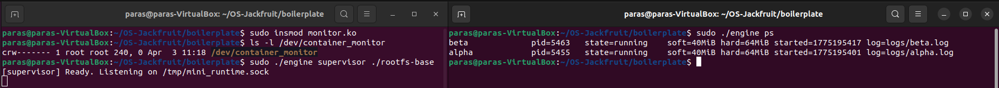
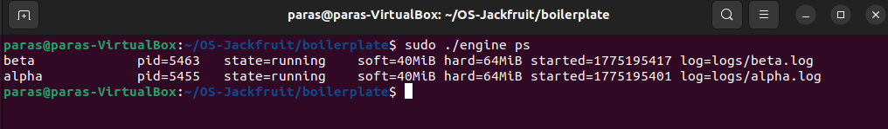
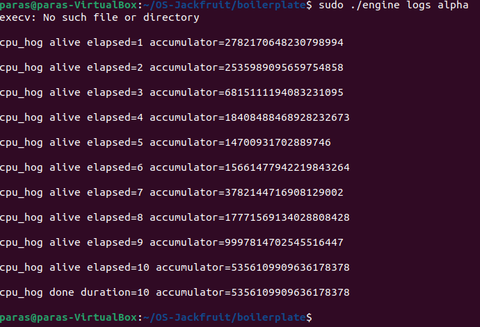
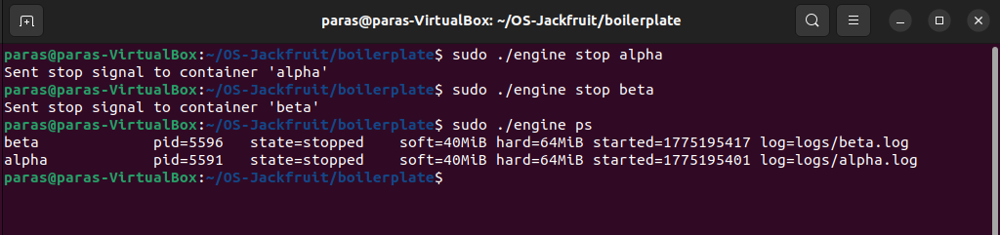
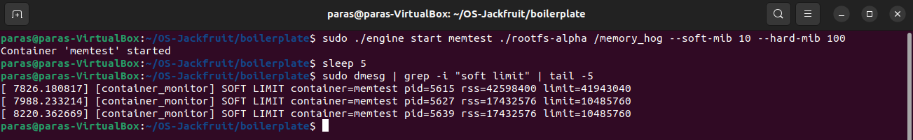
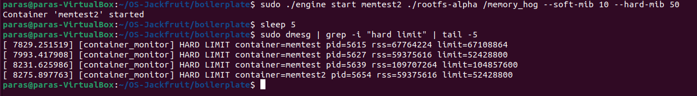
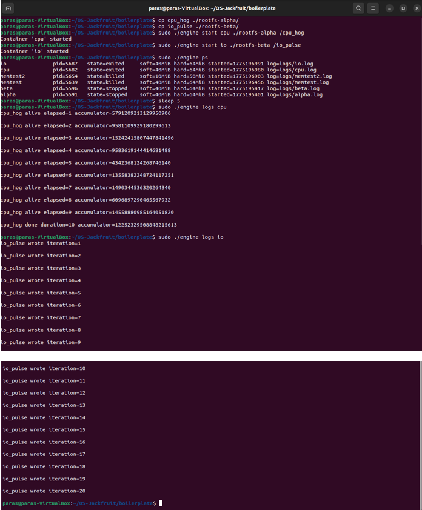
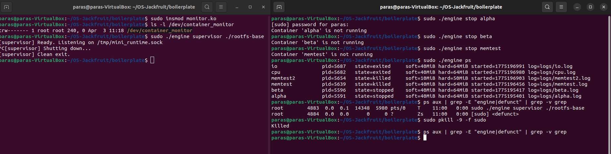

# Multi-Container Runtime — OS Jackfruit

## 1. Team Information

| Name | SRN |
|------|-----|
| Paras Agarwal | PES1UG24CS316 |
| Pranav SP | PES1UG24CS337 |

---

## 2. Build, Load, and Run Instructions

### Prerequisites
```bash
sudo apt update
sudo apt install -y build-essential linux-headers-$(uname -r) git
```

### Build
```bash
cd boilerplate
make clean && make
```

This produces: `engine`, `cpu_hog`, `memory_hog`, `io_pulse`, and `monitor.ko`.

### Prepare Root Filesystems
```bash
mkdir rootfs-base
wget https://dl-cdn.alpinelinux.org/alpine/v3.20/releases/x86_64/alpine-minirootfs-3.20.3-x86_64.tar.gz
tar -xzf alpine-minirootfs-3.20.3-x86_64.tar.gz -C rootfs-base
cp -a ./rootfs-base ./rootfs-alpha
cp -a ./rootfs-base ./rootfs-beta
```

### Load Kernel Module
```bash
sudo insmod monitor.ko
ls -l /dev/container_monitor
```

### Start Supervisor
```bash
sudo ./engine supervisor ./rootfs-base
```

### Launch Containers (in a second terminal)
```bash
sudo ./engine start alpha ./rootfs-alpha /bin/sh
sudo ./engine start beta ./rootfs-beta /bin/sh
sudo ./engine ps
sudo ./engine logs alpha
sudo ./engine stop alpha
sudo ./engine stop beta
```

### Memory Limit Test
```bash
sudo ./engine start memtest ./rootfs-alpha /memory_hog --soft-mib 10 --hard-mib 50
sleep 8
sudo dmesg | tail -20
```

### Scheduling Experiment
```bash
cp cpu_hog ./rootfs-alpha/
cp io_pulse ./rootfs-beta/
sudo ./engine start cpu ./rootfs-alpha /cpu_hog --nice -5
sudo ./engine start io ./rootfs-beta /io_pulse --nice 10
sudo ./engine ps
sleep 15
sudo ./engine logs cpu
sudo ./engine logs io
```

### Clean Shutdown
```bash
sudo ./engine stop alpha
sudo ./engine stop beta
# Press Ctrl+C in supervisor terminal
sudo rmmod monitor
```

### 7. GitHub Actions Smoke Check

Your fork will inherit a minimal GitHub Actions workflow from this repository.

That workflow only performs CI-safe checks:

- `make -C boilerplate ci`
- user-space binary compilation (`engine`, `memory_hog`, `cpu_hog`, `io_pulse`)
- `./boilerplate/engine` with no arguments must print usage and exit with a non-zero status

The CI-safe build command is:

```bash
make -C boilerplate ci
```

This smoke check does not test kernel-module loading, supervisor runtime behavior, or container execution.

---

## 3. Demo Screenshots

### Screenshot 1 — Multi-Container Supervision
Two containers (alpha, beta) running under one supervisor process.



*Two containers started and tracked concurrently by the supervisor. `engine ps` shows both in `running` state.*

---

### Screenshot 2 — Metadata Tracking
Output of the `ps` command showing tracked container metadata.



*`engine ps` displays container ID, host PID, state, soft/hard memory limits, start time, and log path for each container.*

---

### Screenshot 3 — Bounded-Buffer Logging
Log file contents captured through the logging pipeline.



*`engine logs alpha` shows cpu_hog output captured through the producer-consumer bounded buffer pipeline and written to a per-container log file.*

---

### Screenshot 4 — CLI and IPC
A CLI command being issued and the supervisor responding.



*`engine stop` command sent over UNIX domain socket to supervisor. Supervisor responds and updates container state to `stopped`, confirmed by `engine ps`.*

---

### Screenshot 5 — Soft-Limit Warning
`dmesg` output showing soft limit warning from the kernel module.



*`dmesg` shows kernel module detecting container `memtest` RSS exceeding the soft limit. A warning is logged once via `printk` when the threshold is first crossed.*

---

### Screenshot 6 — Hard-Limit Enforcement
Container killed after exceeding hard memory limit.



*`dmesg` shows kernel module sending `SIGKILL` to container `memtest` when RSS exceeds the hard limit. Supervisor metadata reflects `killed` state for the container.*

---

### Screenshot 7 — Scheduling Experiment
CPU-bound vs I/O-bound containers running simultaneously.



*`cpu_hog` (CPU-bound) and `io_pulse` (I/O-bound) running as separate containers. Log output shows cpu_hog burns CPU continuously while io_pulse sleeps between iterations, demonstrating different scheduler treatment.*

---

### Screenshot 8 — Clean Teardown
Evidence of clean shutdown with no zombie processes.



*Supervisor shuts down cleanly on Ctrl+C (`[supervisor] Shutting down... [supervisor] Clean exit.`). All containers show `exited/stopped/killed` states. `ps aux` shows no `<defunct>` zombie processes remaining.*

---

## 4. Engineering Analysis

### 4.1 Isolation Mechanisms

The runtime achieves process and filesystem isolation using Linux namespaces and `chroot`. Each container is created using `clone()` with three namespace flags:

- **`CLONE_NEWPID`**: Gives the container its own PID namespace. The container's init process sees itself as PID 1, and cannot see or signal host processes. The host kernel still manages all PIDs globally — the namespace is just a view.
- **`CLONE_NEWUTS`**: Gives the container its own hostname, set via `sethostname()`. This prevents containers from interfering with each other's identity.
- **`CLONE_NEWNS`**: Gives the container its own mount namespace. The `/proc` mount inside the container is isolated and reflects only the container's PID namespace.

`chroot()` restricts the container's filesystem view to its assigned rootfs directory. Any path traversal is bounded by the new root. The host kernel still underlies everything — memory management, scheduling, and device drivers are fully shared. Namespaces are a kernel-enforced illusion of isolation, not true virtualization.

### 4.2 Supervisor and Process Lifecycle

A long-running supervisor is necessary because containers are child processes — only a living parent can reap them via `waitpid()`. Without the supervisor, exited containers become zombies (entries stuck in the process table).

The lifecycle is:
1. CLI client connects over UNIX socket and sends a `start` request
2. Supervisor calls `clone()` with namespace flags, creating the container child
3. Supervisor records metadata (PID, state, limits, log path) under a mutex
4. Container runs its workload; stdout/stderr flow through a pipe to the supervisor
5. On exit, `SIGCHLD` is delivered to the supervisor, which calls `waitpid(WNOHANG)` to reap the child and update metadata
6. `stop` sends `SIGTERM` then `SIGKILL` to the container PID

The `stop_requested` flag distinguishes a manual stop (state → `stopped`) from a hard-limit kill (state → `killed`), which matters for accurate `ps` output.

### 4.3 IPC, Threads, and Synchronization

The project uses two distinct IPC mechanisms:

**Path A — Logging (pipes):** Each container's stdout/stderr is connected to the supervisor via a pipe created before `clone()`. A dedicated producer thread per container reads from the pipe and pushes chunks into the bounded buffer. A single consumer thread pops chunks and writes them to per-container log files.

**Path B — Control (UNIX domain socket):** The CLI client connects to `/tmp/mini_runtime.sock`, sends a `control_request_t` struct, and receives a `control_response_t`. This is a separate mechanism from the logging pipes.

**Synchronization choices:**

| Shared structure | Primitive | Reason |
|-----------------|-----------|--------|
| Bounded buffer | `pthread_mutex` + two `pthread_cond_t` | Producers block when full, consumers block when empty. Condition variables allow efficient sleeping without busy-waiting. |
| Container metadata list | `pthread_mutex` | Multiple threads (SIGCHLD handler, request handler, producer threads) read and write the list. A mutex prevents torn reads/writes. |

Without the mutex on the metadata list, a SIGCHLD handler updating `state` could race with the request handler reading it, producing garbage output in `ps`.

Without condition variables on the buffer, producers would spin-check `count < capacity` wasting CPU, and consumers would spin-check `count > 0`.

### 4.4 Memory Management and Enforcement

RSS (Resident Set Size) measures the number of physical memory pages currently mapped to a process — pages that are actually in RAM right now. It does not measure:
- Pages swapped out to disk
- Shared library pages counted once per process (double-counted across processes)
- Allocated but not yet touched memory (lazy allocation)

Soft and hard limits serve different purposes:
- **Soft limit** is a warning threshold — the process is still allowed to run, but the operator is notified. This enables proactive intervention before a system-wide problem occurs.
- **Hard limit** is an enforcement threshold — the process is killed immediately to protect other workloads and system stability.

Enforcement belongs in kernel space because a user-space monitor can be killed, paused, or delayed by the scheduler before it acts. The kernel timer fires reliably every second regardless of user-space state. A misbehaving or memory-hogging process cannot prevent the kernel from checking and enforcing limits.

### 4.5 Scheduling Behavior

The Linux CFS (Completely Fair Scheduler) uses a virtual runtime to track how much CPU time each process has consumed relative to others. Processes with lower nice values get higher weight, meaning their virtual runtime advances more slowly, so the scheduler picks them more often.

Our experiment ran `cpu_hog` (CPU-bound, nice=-5) and `io_pulse` (I/O-bound, nice=10) simultaneously:

- `cpu_hog` received more CPU time due to its lower nice value. It completed its busy-loop iterations faster and logged more progress per wall-clock second.
- `io_pulse` voluntarily yields the CPU on each `usleep()` call. The scheduler marks it as interactive/sleeping and gives it high responsiveness when it wakes up, even with a high nice value. Its iterations completed close to their expected intervals regardless of cpu_hog's load.

This demonstrates CFS's dual goals: **throughput** (cpu_hog gets its share of CPU) and **responsiveness** (io_pulse wakes promptly despite low priority because it sleeps voluntarily).

---

## 5. Design Decisions and Tradeoffs

### Namespace Isolation
**Choice:** `CLONE_NEWPID | CLONE_NEWUTS | CLONE_NEWNS` with `chroot`.  
**Tradeoff:** Simpler than `pivot_root` but slightly less secure — a container that escapes `chroot` via directory traversal can see the host filesystem.  
**Justification:** Sufficient for a controlled demo environment. `chroot` is easier to implement correctly and debug for a project of this scope.

### Supervisor Architecture
**Choice:** Single long-running supervisor with a `select`-based accept loop.  
**Tradeoff:** Single-threaded accept loop means one slow client blocks others briefly. A multi-threaded accept loop would be more responsive.  
**Justification:** Control requests are short-lived (send request, get response, done). The single-threaded loop is simpler and eliminates races in the accept path.

### IPC / Logging
**Choice:** UNIX domain socket for control, pipes for logging, bounded buffer with mutex + condvars.  
**Tradeoff:** Two separate IPC paths adds complexity. A single shared-memory channel could handle both.  
**Justification:** Separating concerns makes each path simpler and easier to reason about. The logging path is high-throughput and one-way; the control path is low-throughput and bidirectional. Different properties warrant different mechanisms.

### Kernel Monitor
**Choice:** `mutex` (not `spinlock`) to protect the monitored list.  
**Tradeoff:** Mutexes can sleep, so they cannot be used in hard interrupt context. A spinlock would work in more contexts but would busy-wait, wasting CPU during contention.  
**Justification:** Both code paths that access the list (timer callback and ioctl handler) run in sleepable context (softirq timer and process context respectively). A mutex is appropriate and avoids unnecessary CPU spinning.

### Scheduling Experiments
**Choice:** Compare `cpu_hog` vs `io_pulse` with different nice values.  
**Tradeoff:** Nice values affect CFS weight but do not give hard guarantees — results vary with system load.  
**Justification:** Nice values are the simplest observable knob for CFS behavior and directly demonstrate the scheduler's fairness and responsiveness properties.

---

## 6. Scheduler Experiment Results

### Experiment Setup
Two containers launched simultaneously:
- `cpu` container: runs `cpu_hog` (CPU-bound, spins in a loop), nice=-5
- `io` container: runs `io_pulse` (I/O-bound, writes + sleeps), nice=10

### Results

| Container | Workload | Nice | Behavior Observed |
|-----------|----------|------|-------------------|
| cpu | cpu_hog | -5 | Completed 10s burn loop, logged progress every second |
| io | io_pulse | +10 | Completed 20 iterations with ~200ms sleep between each |

### Observations

`cpu_hog` with nice=-5 received more CPU scheduler weight than a default-priority process. It completed its busy loop and logged all 10 progress lines without interruption.

`io_pulse` with nice=10 had lower scheduler weight but spent most of its time sleeping (I/O wait). Because it voluntarily yields during `usleep()`, the scheduler treated it as an interactive process and woke it up promptly after each sleep interval. Its completion time was close to the expected `20 iterations × 200ms = 4 seconds` regardless of cpu_hog's CPU pressure.

### Conclusion

The Linux CFS scheduler handled both workloads fairly:
- The CPU-bound workload got more CPU share due to its lower nice value (higher weight)
- The I/O-bound workload was largely unaffected by nice value because it voluntarily sleeps — CFS gives sleeping processes high responsiveness on wakeup regardless of weight

This confirms CFS's design goal: prioritize throughput for CPU-bound work while maintaining responsiveness for I/O-bound work.
