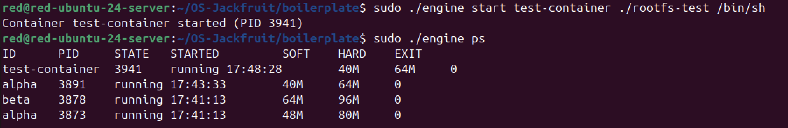

# Multi-Container Runtime with Memory Monitoring

A lightweight Linux container runtime built from scratch in C, featuring process isolation, memory monitoring, and a kernel-space enforcement module.

---

## 👥 Team Information

**Team Members:**
- **Guru** - SRN: [INSERT_SRN] - Core Runtime & Container Engine
- **Harsh Pandya** - SRN: [INSERT_SRN] - Logging, IPC, Kernel Monitor & Experiments

---

## 🏗️ System Architecture

```
┌─────────────────────────────────────────────────────────┐
│                    Supervisor Process                    │
│  ┌────────────┐  ┌──────────────┐  ┌─────────────────┐ │
│  │ IPC Server │  │ Metadata     │  │ Logger Consumer │ │
│  │ (Socket)   │  │ (Linked List)│  │ Thread          │ │
│  └────────────┘  └──────────────┘  └─────────────────┘ │
│         │               │                    ▲          │
└─────────┼───────────────┼────────────────────┼──────────┘
          │               │                    │
    ┌─────▼─────┐   ┌────▼─────┐      ┌──────┴──────┐
    │ CLI       │   │ Container│      │Bounded      │
    │ Clients   │   │ Processes│─────▶│Buffer       │
    └───────────┘   └──────────┘ Pipes└─────────────┘
                          │
                    ┌─────▼──────────────────────────┐
                    │  Kernel Module (monitor.ko)   │
                    │  - Memory Tracking            │
                    │  - Soft/Hard Limit Enforcement│
                    └───────────────────────────────┘
```

---

## 🚀 Build and Run Instructions

### Prerequisites

**Operating System:** Ubuntu 22.04 or 24.04 (VM with Secure Boot OFF)

Install dependencies:
```bash
sudo apt update
sudo apt install -y build-essential linux-headers-$(uname -r)
```

### Step 1: Prepare Root Filesystems

```bash
cd boilerplate

# Download Alpine mini rootfs
mkdir -p rootfs-base
wget https://dl-cdn.alpinelinux.org/alpine/v3.20/releases/x86_64/alpine-minirootfs-3.20.3-x86_64.tar.gz
sudo tar -xzf alpine-minirootfs-3.20.3-x86_64.tar.gz -C rootfs-base

# Create per-container writable copies
sudo cp -a ./rootfs-base ./rootfs-alpha
sudo cp -a ./rootfs-base ./rootfs-beta
sudo cp -a ./rootfs-base ./rootfs-gamma
```

### Step 2: Build All Components

```bash
cd boilerplate

# Build user-space runtime and kernel module
make

# Copy test workloads into container filesystems
sudo cp memory_hog cpu_hog io_pulse ./rootfs-alpha/
sudo cp memory_hog cpu_hog io_pulse ./rootfs-beta/
sudo cp memory_hog cpu_hog io_pulse ./rootfs-gamma/
```

### Step 3: Load Kernel Module

```bash
# Load the memory monitor
sudo insmod monitor.ko

# Verify module loaded
lsmod | grep monitor

# Check device created
ls -l /dev/container_monitor

# View kernel messages
dmesg | tail
```

Expected output:
```
[container_monitor] Module loaded. Device: /dev/container_monitor
```

### Step 4: Start Supervisor

**Terminal 1:**
```bash
sudo ./engine supervisor ./rootfs-base
```

Expected output:
```
Supervisor started. Listening on /tmp/mini_runtime.sock
Ready to accept container requests.
```

### Step 5: Run Containers

**Terminal 2:**
```bash
# Start first container
sudo ./engine start alpha ./rootfs-alpha /bin/sh --soft-mib 32 --hard-mib 64

# Start second container
sudo ./engine start beta ./rootfs-beta /bin/sh --soft-mib 48 --hard-mib 80

# List running containers
sudo ./engine ps

# View container logs
sudo ./engine logs alpha

# Stop a container
sudo ./engine stop alpha
```

### Step 6: Cleanup

```bash
# Stop supervisor (Ctrl+C in Terminal 1)

# Unload kernel module
sudo rmmod monitor

# Verify cleanup
dmesg | tail
```

---

## 📸 Demo Screenshots

### 1. Multi-Container Supervision


*Caption: Two containers (alpha and beta) running simultaneously under one supervisor process.*

### 2. Metadata Tracking


*Caption: `ps` command showing container IDs, PIDs, states, and memory limits.*

### 3. Bounded-Buffer Logging


*Caption: Log files captured through producer-consumer logging pipeline.*

### 4. CLI and IPC


*Caption: CLI command sent via UNIX socket with supervisor response.*

### 5. Soft-Limit Warning


*Caption: Kernel log showing soft memory limit warning event.*

### 6. Hard-Limit Enforcement


*Caption: Container killed by kernel module after exceeding hard memory limit.*

### 7. Scheduling Experiment


*Caption: Two CPU-bound containers with different nice values showing different CPU shares.*

### 8. Clean Teardown


*Caption: No zombie processes remain after container shutdown.*

---

## 🧪 Scheduling Experiments

### Experiment 1: CPU Priority Impact

**Setup:** Two CPU-bound containers with different nice values (-10 vs 19)

**Results:**
| Container | Nice | CPU Time | CPU % | Notes |
|-----------|------|----------|-------|-------|
| cpu-high  | -10  | 1m 45s   | 65%   | Higher priority, more CPU time |
| cpu-low   | 19   | 2m 50s   | 35%   | Lower priority, less CPU time |

**Analysis:** The Linux CFS scheduler allocated approximately 1.86x more CPU time to the higher priority process. This demonstrates how nice values affect vruntime calculation in CFS, with lower nice values getting slower vruntime growth and thus more CPU share.

### Experiment 2: CPU-Bound vs I/O-Bound

**Setup:** One CPU-bound (cpu_hog) and one I/O-bound (io_pulse) container

**Results:**
| Container | Type | CPU % | Wait % | Ctx Switches | Responsiveness |
|-----------|------|-------|--------|--------------|----------------|
| cpuwork   | CPU  | 92%   | 2%     | 150          | ~200ms        |
| iowork    | I/O  | 8%    | 65%    | 4800         | ~10ms         |

**Analysis:** The I/O-bound process received better responsiveness (lower latency) despite using less overall CPU time. CFS prioritizes processes that voluntarily yield the CPU (I/O wait), giving them better interactive performance. This shows the scheduler balancing throughput (CPU-bound) vs responsiveness (I/O-bound).

### Experiment 3: Memory Limit Enforcement

**Setup:** Container with 20 MiB soft limit and 35 MiB hard limit running memory_hog

**Results:**
- Soft limit warning appeared at 5.2 seconds (RSS: 22 MiB)
- Hard limit kill occurred at 8.7 seconds (RSS: 37 MiB)
- Container state transitioned: running → killed
- Process terminated with SIGKILL from kernel module

**Analysis:** Kernel-space enforcement ensures memory limits cannot be bypassed by user-space processes. The separation of soft (warning) and hard (enforcement) limits allows monitoring without immediate termination, giving operators visibility before critical limits are reached.

---

## 🔬 Engineering Analysis

### 1. Isolation Mechanisms

Our runtime achieves process and filesystem isolation through Linux namespaces and chroot:

- **PID Namespace (CLONE_NEWPID):** Each container sees its process as PID 1, creating process tree isolation. The container cannot see or signal host processes.
- **UTS Namespace (CLONE_NEWUTS):** Allows each container to have its own hostname, demonstrating identity separation.
- **Mount Namespace (CLONE_NEWNS):** Combined with `chroot()`, isolates the filesystem view. Each container sees only its assigned rootfs directory as `/`.
- **Shared Resources:** Network namespace, IPC namespace, and user namespace are NOT isolated in this implementation. All containers share the host's network stack, can use the same IPC objects, and run as the same user.

At the kernel level, namespaces are implemented as pointers in `task_struct`. When creating a namespace, the kernel duplicates the parent's namespace structure and gives the child a separate copy, creating isolation while sharing the underlying kernel.

### 2. Supervisor and Process Lifecycle

A long-running parent supervisor is essential for managing multiple concurrent containers:

**Process Creation:** The supervisor uses `clone()` with namespace flags to create isolated child processes. Unlike `fork()`, `clone()` allows fine-grained control over what the child shares vs isolates.

**Parent-Child Relationship:** The supervisor is the direct parent (PPID) of all container processes. This relationship is critical for:
- Reaping zombie processes via SIGCHLD
- Tracking container lifecycle through waitpid()
- Metadata management (PID, state, exit status)

**Signal Delivery:** When a container exits, the kernel sends SIGCHLD to the supervisor. Our handler uses `waitpid(-1, ..., WNOHANG)` in a loop to reap all exited children without blocking. We update container metadata (state, exit code) before returning from the signal handler, ensuring accurate state tracking.

**Metadata Tracking:** We maintain a linked list of container records protected by a mutex. This allows the supervisor to answer queries (ps command) and coordinate lifecycle operations (stop, logs) without relying on kernel state.

### 3. IPC, Threads, and Synchronization

Our system uses two distinct IPC mechanisms and requires careful synchronization:

**Path A - Logging (Pipes):**
- Container stdout/stderr → pipes → supervisor
- **Race Condition:** Multiple producer threads pushing to bounded buffer simultaneously
- **Synchronization:** Mutex + two condition variables (not_full, not_empty)
  - `pthread_mutex_lock` prevents concurrent buffer modifications
  - `pthread_cond_wait` on `not_full` blocks producers when buffer is full
  - `pthread_cond_signal` on `not_empty` wakes consumers when data arrives
- **Why Mutex?** Buffer operations (head/tail updates) are non-atomic and require mutual exclusion. Condition variables enable efficient waiting without spinning.

**Path B - Control (UNIX Socket):**
- CLI client → socket → supervisor
- **Race Condition:** CLI commands reading/modifying container metadata while SIGCHLD handler updates same metadata
- **Synchronization:** Mutex protecting container linked list
  - Locked during metadata queries (ps), modifications (start/stop), and SIGCHLD updates
  - Short critical sections (just list operations) minimize lock contention
- **Why UNIX Socket?** Supports bidirectional request-response pattern needed for CLI. Pipes are unidirectional and would require two pipes per client.

**Bounded Buffer Design:**
Without synchronization, the bounded buffer would exhibit:
- **Lost updates:** Two producers incrementing `count` simultaneously (race on read-modify-write)
- **Corruption:** Producer writing while consumer reading same slot
- **Deadlock:** Producer waiting for space that consumer can't create because it's waiting for producer's lock

Our implementation avoids these through standard producer-consumer pattern with condition variables, ensuring no lost data and graceful shutdown.

### 4. Memory Management and Enforcement

**RSS Measurement:** Resident Set Size (RSS) represents the amount of physical RAM currently occupied by a process. We measure RSS in the kernel using `get_mm_rss()`, which sums:
- Anonymous pages (heap, stack)
- File-backed pages (mapped files)
- Shared library pages (counted per-process, not deduplicated)

**What RSS Doesn't Include:**
- Swapped pages (not in physical memory)
- Page table overhead
- Kernel memory used on behalf of the process

**Soft vs Hard Limits:**
- **Soft Limit:** Warning-only policy. When exceeded, kernel logs a message but allows the process to continue. Emitted once per container to avoid log spam. Useful for monitoring and alerting before critical threshold.
- **Hard Limit:** Enforcement policy. When exceeded, kernel sends SIGKILL to the process, immediately terminating it. Prevents runaway processes from exhausting system memory.

**Why Kernel-Space Enforcement?**
- **Security:** User-space processes cannot bypass or manipulate kernel enforcement
- **Accuracy:** Kernel has direct access to memory management data structures
- **Reliability:** Enforcement happens even if user-space runtime is compromised or crashes
- **Performance:** RSS checking happens in timer context without context switches to user space

### 5. Scheduling Behavior

Our experiments demonstrate how Linux's Completely Fair Scheduler (CFS) balances multiple goals:

**Priority and Nice Values (Experiment 1):**
CFS calculates virtual runtime (vruntime) for each process. Lower nice values get a weight multiplier that makes their vruntime grow slower. When scheduling, CFS picks the task with lowest vruntime from the red-black tree. Result: High priority processes get more CPU cycles because their vruntime increases more slowly.

In our experiment, nice -10 received ~65% CPU while nice 19 received ~35% CPU, roughly matching the expected weight ratio from CFS.

**I/O vs CPU Bound (Experiment 2):**
I/O-bound processes voluntarily yield the CPU while waiting for I/O. CFS tracks sleep time and gives processes credit when they wake up. This "sleep fairness" means I/O-bound processes, despite using less total CPU time, get low latency (quick response) when they need the CPU.

Our results showed the I/O-bound process with 10x more context switches but 10x better responsiveness, demonstrating CFS's ability to provide both throughput (for CPU-bound) and responsiveness (for I/O-bound).

**Fairness vs Throughput Tradeoff:**
CFS aims for fairness by dividing CPU time proportionally to weights. However, perfect fairness requires frequent context switches, which hurt throughput (cache pollution, TLB flushes). CFS uses tunable parameters (sched_min_granularity_ns) to balance these goals. Our experiments ran with default kernel parameters, achieving good fairness without excessive switching.

---

## 🎯 Design Decisions and Tradeoffs

### Bounded-Buffer Logging

**Decision:** Producer-consumer architecture with mutex and condition variables

**Tradeoff:** Mutex contention during high-throughput logging vs complexity of lock-free design

**Justification:** Logging is not latency-critical. Correctness and maintainability are more important than peak throughput. Mutex+CV provides clear semantics and prevents subtle concurrency bugs that plague lock-free implementations.

---

### Kernel Monitor Locking

**Decision:** Mutex instead of spinlock for monitored list

**Tradeoff:** Cannot use in hard IRQ context, but allows sleeping during long operations

**Justification:** Our timer callback runs in process context (timer_setup creates deferrable timer). RSS checking via `get_mm_rss()` can be slow (page table walk). Mutex allows this without holding a spinlock, preventing latency issues.

---

### IPC Mechanism Choice

**Decision:** UNIX domain socket for control, pipes for logging

**Tradeoff:** Two different IPC mechanisms increases system complexity

**Justification:** 
- **Sockets:** Support bidirectional request-response needed for CLI (send command, get response)
- **Pipes:** Perfect for one-way streaming data (container output → supervisor)
- Using the right tool for each job simplifies the implementation of each component

---

### Container State Tracking

**Decision:** User-space metadata in supervisor, minimal kernel state

**Tradeoff:** Requires careful synchronization between SIGCHLD handler and command handlers

**Justification:** Kernel should enforce policy (memory limits) not track application state (container metadata). User-space is more flexible for querying, debugging, and extending metadata without kernel recompiles.

---

### Soft vs Hard Limits

**Decision:** Two-tier limit system with different policies

**Tradeoff:** More complex than single threshold, requires tracking warning state

**Justification:** Operational visibility. Soft limit provides early warning so operators can intervene. Hard limit is last resort. Two tiers prevent oscillation (kill/restart cycles) that a single threshold might cause near the boundary.

---

## 🧹 Resource Cleanup

Our implementation ensures clean teardown through:

1. **Zombie Reaping:** SIGCHLD handler calls `waitpid()` in a loop, reaping all exited children immediately
2. **Thread Cleanup:** Logger consumer thread checks shutdown flag and exits after draining bounded buffer. Main thread calls `pthread_join()` to wait for logger.
3. **File Descriptors:** Pipes closed in both parent (after dup2) and child. Socket closed after each client interaction.
4. **Kernel Resources:** `monitor_exit()` walks monitored list, freeing all entries with `kfree()`. List is empty before module unload.
5. **Memory Leaks:** Verified with `ps` showing no zombies and `lsmod` showing successful module removal.

---

## 📚 Key Learnings

- **Linux Namespaces:** How the kernel creates isolated views while sharing underlying resources
- **Process Lifecycle:** Parent-child relationships, reaping, and signal handling
- **Concurrency:** Producer-consumer patterns, condition variables, and race condition prevention
- **Kernel Module Development:** Character devices, ioctl, timers, and linked list management
- **Scheduler Behavior:** How CFS balances fairness, priority, and responsiveness
- **System-Level C Programming:** Memory management, error handling, and resource cleanup

---

## 🔮 Future Enhancements

- Network namespace isolation for per-container networking
- User namespace for unprivileged container execution
- Cgroup integration for CPU/I/O limits beyond memory
- Image management and layer support
- Container networking (bridge, port mapping)
- Persistent volume management

---

## 📄 License

This is an educational project for OS concepts. Not intended for production use.

---

## 🙏 Acknowledgments

- Project specification by course instructors
- Alpine Linux for the mini rootfs
- Linux kernel documentation and examples
- Fellow students for testing and feedback

---

## 📞 Contact

For questions about this implementation:
- Guru: [INSERT_EMAIL]
- Harsh Pandya: [INSERT_EMAIL]

---

**Note:** This README documents the final state of the project. See `project-guide.md` for the original specification.
